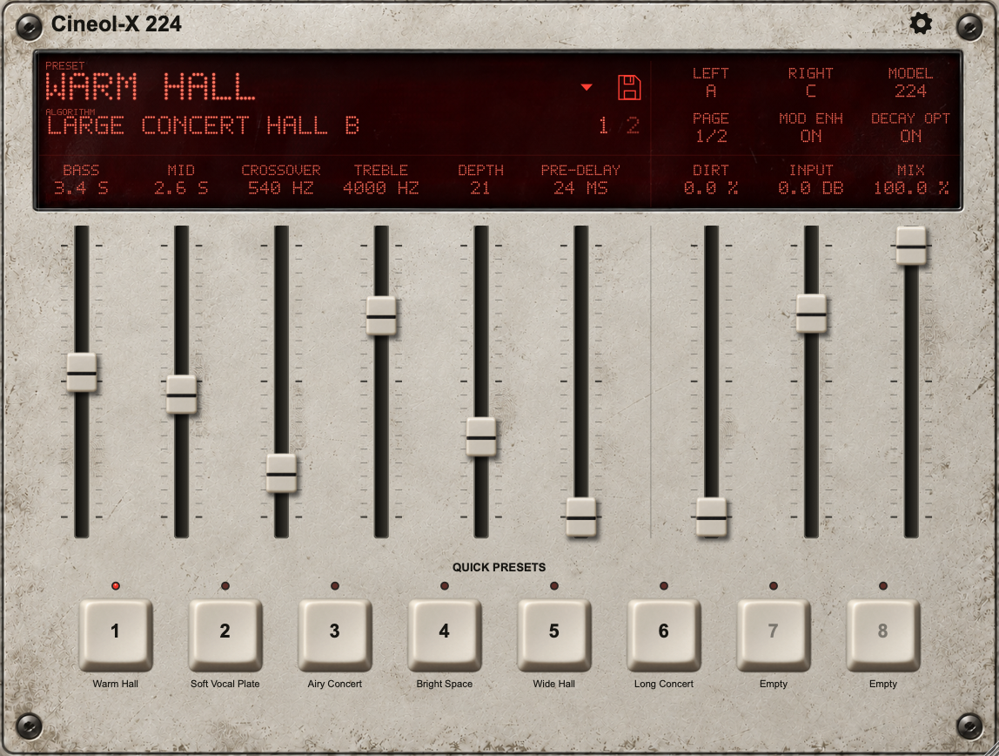
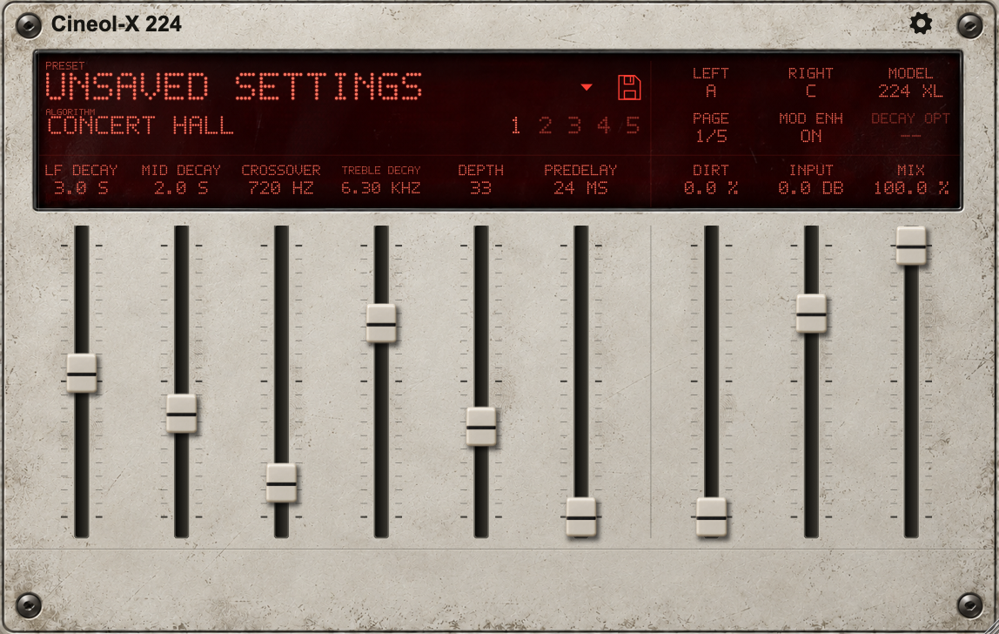

# Cineol-X 224

Cineol-X 224 is a native reverb plugin and a portable Daisy DSP project based on
the six programs of the **original Lexicon 224, firmware v4.4** plus a desktop
preview of all 22 **224 XL v8.21** programs. The desktop plugin is version **0.9.6**, with the metal-panel artwork, 21-mark fader scales
and six page-bound faders beside permanent Dirt, Input and Mix faders.

## What's new in 0.9.6

- **Fixed rebuild:** ROM setup remains visible when adding XL to an imported
  original 224. Windows has separate file/ZIP and folder pickers. Import errors
  identify unsupported firmware and incomplete chip sets. XL display preparation
  keeps its 64 KiB scratch memory outside fixed-size coroutine frames.
- Native **XL Dynamic Decay/gating**, **LF/MID STOP DECAY**, **REV STOP DLY**
  and **Decay Optimization** are now active for all 19 XL reverb algorithms.
  The three non-reverb effects retain their firmware-specific controls.
- Dynamic Decay and Decay Opt switches, together with stop settings, are saved
  in sound presets and DAW sessions. The existing Decay Opt button serves both
  original 224 and XL; no duplicate control or new host parameter ID was added.
- **Dyn Decay** replaces the duplicate **Page n/n** header button, preserving
  text alignment and spacing. Numbered buttons provide all page navigation.
- Quick preset keys use their LEDs to show selection, without hover, focus or
  selection underlines. The README screenshots show the updated editor.
- Version-4 XL caches add dynamics state and measured control clocks.
  **Re-import your complete original 224XL v8.21 ROM set once when upgrading
  from 0.9.5.** The previous XL cache, original-224 cache and presets are retained.
- All 19 reverb programs passed 27,117 exact firmware controller transitions;
  full plugin checks covered all 28 algorithms, 618 active fader endpoints and
  44.1/48/96 kHz, with no audio callback allocations/releases.

## Earlier changes in 0.9.5

Changes since the previous published release, 0.6.0:

- Desktop preview of all 22 native 224 XL v8.21 algorithms, alongside the six
  original 224 programs, with automatic engine selection, dedicated parameter
  pages and algorithm-specific output pairs.
- Optional **Spillover** for 224/XL algorithm changes, with a 1–10 second tail
  fade (default 5 seconds), continuous dry audio and bounded two-engine processing.
- Eight photographic **Quick presets** keys, assigned through the preset browser
  and saved separately for each plugin instance in DAW sessions.
- A shared named preset bank with search, multiple algorithm filters, replacement
  confirmation, firmware-aware recall and legacy preset adoption.
- Animated fader recall, direct numbered page selection, scrolling preset names,
  `INF` labels for unbounded XL values and a full-size metal faceplate.
- Editor-owned popup menus and preset dialogs prevent a hidden instance's
  unfinished dialog from blocking another instance's controls. Leaving the
  editor cancels unfinished dialogs and allows Save to reopen immediately.

Spillover and quick presets are desktop features. This release's UI and transition
changes leave Daisy processing unchanged. Plugin identifiers and existing
parameter IDs remain stable. Version 0.9.6 adds the XL dynamics update above.

Download the **macOS Universal** (AU/VST3/Standalone) or **Windows x64**
(VST3/Standalone) archives from the
[0.9.6 release](https://github.com/temaniak/cineolX/releases/tag/v0.9.6).
See the [release notes](docs/releases/v0.9.6.md) for installation, compatibility
and validation details. ROMs and prepared banks are not included.

**Before first use:** import your own **Lexicon 224 v4.4 ROM1–ROM5** files
for the six original-224 programs. The optional 22-program **224 XL** preview
requires a separate complete **224 XL v8.21** ROM set. Use **Choose ROMs...**
in the plugin; see [ROM requirements and first use](#rom-requirements-and-first-use).

Primary repository: [temaniak/cineolX](https://github.com/temaniak/cineolX).

ChatGPT was actively used during the creation of this project, assisting with
code development, debugging, testing and documentation.



This repository contains the Cineol DSP, plugin, ROM import tools and a generic
Daisy adapter. [Reflexion](https://github.com/joelanders/reflexion-224) is an
external, pinned Git submodule. Its emulator prepares and validates control
data; the audio engine runs native C++ networks. No ROM files or prepared banks
are shipped in this repository or embedded in the desktop plugin.

## Programs and controls

| Program | Name |
| --- | --- |
| 01 | Small Concert Hall B |
| 02 | Vocal Plate |
| 03 | Large Concert Hall B |
| 04 | Acoustic Chamber |
| 05 | Percussion Plate A |
| 06 | Small Concert Hall A |
| 07 | Concert Hall (224 XL) |
| 08 | Bright Hall (224 XL) |
| 09 | Dark Hall (224 XL) |
| 10 | Plate (224 XL) |
| 11 | Room (224 XL) |
| 12 | Rich Chamber (224 XL) |
| 13 | Small Room (224 XL) |
| 14 | Chamber (224 XL) |
| 15 | Dark Chamber (224 XL) |
| 16 | Inverse Room (224 XL) |
| 17 | Small Plate (224 XL) |
| 18 | CD Plate A (224 XL) |
| 19 | CD Plate B (224 XL) |
| 20 | Rich Plate (224 XL) |
| 21 | Chorus & Echo (224 XL) |
| 22 | Resonant Chords (224 XL) |
| 23 | Multiband Delay (224 XL) |
| 24 | Hall / Hall (224 XL) |
| 25 | Plate / Plate (224 XL) |
| 26 | Plate / Hall (224 XL) |
| 27 | Plate / Chorus (224 XL) |
| 28 | Rich Split (224 XL) |

The main parameters are Bass Decay, Mid Decay, Crossover, Treble Decay, Depth,
Pre-delay, Diffusion, Input Gain, Dry/Wet and Program. The plugin also exposes
Mod Enhancement, Decay Optimization, continuous Dirt and independent
left/right choices from outputs A–D. Original 224 and regular XL reverbs use
A/C by default; split algorithms use A/B to include both engines, and Chorus &
Echo uses C/A to preserve the input orientation. Manual algorithm selection
recalls the XL factory controls and the appropriate output pair. Original 224
controls, Input, Mix and Dirt are retained.

Bass/Mid labels use the original discrete time scale; they are not a promise of
measured T60. Diffusion has no effect in Acoustic Chamber. Small and Large Hall
B share a topology; their factory settings differ. By default, changing programs
clears the previous reverb tail immediately. The desktop-only Spillover option
preserves it with a timed fade. Pre-delay changes can produce a transient.

The expanded red display has six labels aligned with the six variable faders.
Click a numbered selector beside the algorithm name to switch pages. Main contains
Bass, Mid, Crossover, Treble, Depth and Pre-delay; Detail places Diffusion in
slot five. Unused slots are disabled and their caps park at the bottom, with
`--` on the display. Parking never writes a parameter minimum. Page changes
animate the caps over 320 ms but preserve every control and the reverb tail.
Preset recall also animates Dirt, Input and Mix; Dirt retains its inverted
`analog` parameter mapping without writing parameter events during visual motion.
All caps and rails retain the same geometry on every page. Inactive caps are
dark grey rather than translucent. Values appear only on the red display;
the longer rails occupy the space previously used by the numeric text boxes.
The three permanent faders on the right are Dirt, Input and Mix. Their display
cells use the same text size as the other parameter names; no labels or values
are repeated on the metal panel. The lower plate extends below the long faders
to hold eight quick preset keys; the bottom mounting screws sit below that row.
The faceplate uses one full-size photographic bitmap with uniform grain; its
lower area is drawn into the new asset rather than stitched from stretched strips. The red display has one shared divider and three right-side
columns aligned with Dirt, Input and Mix.

Internal menus, settings and preset dialogs use a separate, evenly worn metal
texture with a fixed grain scale, rather than stretched sections of the faceplate.
They share dark frames and red header/input surfaces. See the
[preset dialog](docs/images/cineol-x-224-preset-dialog.png). The system file
picker retains its platform appearance.

Popup menus and preset dialogs belong to their plugin editor. Leaving or hiding
the editor cancels unfinished dialogs, and a preset dialog in one instance does
not block controls in another instance.

Click the algorithm name on the red display to open the single algorithm list.
It selects the native engine automatically; the corner
of the display indicates **224** or **224 XL**. There is no separate firmware
selector. Clicking the engine indicator opens ROM import. XL exposes its actual
parameter pages (two to seven pages per program) through the same six faders:
LF/MID decay, filters, depth/attack, pre-delay, Chorus, Diffusion, Definition,
levels, delays, pan, feedback and Size where used. Size updates the decay-time
labels and available variable pre-delay range. Inactive controls are parked,
dark and marked `--`. XL's unbounded upper frequency/decay display values are
shown as `INF` with their units, so an active fader at its limit does not look
unavailable. Version 0.9.6 enables **Dynamic Decay**, LF/MID
**STOP DECAY**, **REV STOP DLY**, and **Decay Optimization** for XL reverb
algorithms. Dynamic Decay switches to the stop decay times after the input
level falls; shorter stop times produce gated tails. REV STOP DLY holds the
normal decay before that change. The existing **Decay Opt** switch controls
the selected engine, including original 224 and XL, and adapts feedback
diffusion during decay. Both switches and every stop setting are saved in
presets and DAW sessions. Mode Enhancement is available for algorithms with
modulation taps; reverb dynamics are unavailable on the three non-reverb
effects, matching their firmware controls. Arithmetic and controller checks
do not establish complete hardware equivalence.

Numbered selectors beside the algorithm name jump directly to a parameter page;
the selected page is bright and other numbers are dim. These numbered buttons
are the only page selectors in version 0.9.6. The right header uses
**Left / Right / Model** above **Dyn Decay / Mod Enh / Decay Opt**, aligned with
the three permanent fader columns. Dynamic Decay replaces the duplicate
**Page n/n** button, keeping the existing header geometry. Quick preset keys use their LEDs for selection and have
no hover or selection underline.
The settings gear uses colour feedback without an enclosing frame.

Preset format 4 records the firmware identity and every parameter,
including controls on hidden pages. The shared browser lists presets together
with their algorithm and model. An unavailable-firmware preset remains listable;
recalling it reports an error and preserves the current settings.

The red display includes a **Preset** selector and a disk-shaped **Save preset**
button. Preset and algorithm names occupy the left side of the display; the
large numeric program indicator has been removed to give these names more room.
Long preset names scroll at a fixed text size, with a two-second pause at each
end. The upper-right display area contains output A–D selection, Dynamic Decay,
Mode Enhancement, Decay Optimization and engine identity.
**Save preset** asks only for a name and adds the current settings to
one managed user preset bank. Click the preset name to open the themed browser:
all presets appear in one alphabetical list, with their algorithm/model beside
each name. Search by preset, algorithm or model, or click algorithm checkboxes
to filter by one or several algorithms. Checked algorithms form a union;
**All algorithms** clears the filter. Double-click a preset, press Enter in the
list, or use **Load preset** to recall its algorithm and settings. Filtering
and searching do not alter audio or parameters. The browser refreshes the
shared bank each time it opens. See the [browser preview](docs/images/cineol-x-224-preset-browser.png), with isolated demonstration presets.

Eight numbered **Quick presets** keys sit on the extended lower faceplate,
above the mounting screws. Select a preset in the browser, choose **Assign to...**,
then choose a key from 1 to 8. Assignment replaces that key's previous preset
without loading sound. Press a populated key to recall the preset; empty keys
are inactive. A red indicator marks the recalled preset and clears when its
sound settings are edited. Keys refer to named entries in the shared bank, so
replacing a bank preset updates future recalls. Assignments are saved per plugin
instance in DAW sessions and are excluded from sound presets. Older sessions
restore eight empty keys. Missing or unavailable presets leave the current
sound unchanged and display an error.
See the [quick keys](docs/images/cineol-x-224-quick-presets.png) and
[assignment browser](docs/images/cineol-x-224-quick-preset-browser.png) previews,
including the [eight-slot menu](docs/images/cineol-x-224-quick-assignment-menu.png).
Saving an existing name offers to replace it. No file or folder chooser is
required. A preset stores its firmware, algorithm, all fader values, processing
switches and output pair. **Low latency** and **Spillover** remain instance settings. The
bank is stored in `Presets/User Presets.cineolbank` beside the imported ROM
bank. Previously saved `.cineol224` presets in this default folder are adopted
when the user bank is first saved; the original files are preserved. The preset
name and its modified marker (`*`) survive DAW state restoration even if the
user bank is unavailable.

Loading a preset applies the engine, algorithm and settings as one complete audio control update.
The fader caps then animate to their recalled positions over 320 ms, as a
visual homage to the 960L. This motion does not interpolate the DSP parameters
or generate extra automation events. Manual edits interrupt the animation.
Presets using the same selected program retain the existing reverb tail;
changing the selected program clears it unless Spillover is enabled. Moving between Small and Large Hall
B still counts as a program change, even though they share a topology.
Pre-delay changes retain the existing transient limitation.

The permanent **Dirt** fader continuously blends the existing filtered and
digital paths. At 0% it retains the former clean endpoint; at 100% it retains
the former Digital Dirt endpoint. The squared response gives the lower half
gentler control: 50% Dirt requests a 25% dirty blend. The existing smoothing
avoids abrupt filter-path changes, without running a second reverb. The
`analog` parameter keeps its index and clean polarity, but is now continuous
and named **Clean Amount**; old boolean values still map to the two endpoints.
Fractional Dirt is stored in presets and DAW state. Plugin IDs
are retained: AU `aufx/Nh24/Rflx`, bundle ID `net.joelanders.nativehall224`.

The gear in the top-right corner opens **Settings**. **Low latency** sends the dry input directly at the project sample rate
and reports **0 samples** of plugin latency at every supported rate. Only the
wet signal passes through the resamplers and reverb; its filter delay and
pre-delay remain unchanged. This changes the timing between dry and wet (by
70 samples, about 1.46 ms, at 48 kHz). At 100% wet the DSP output is unchanged,
but the DAW no longer compensates its delay. Audio-interface/buffer latency is
independent of this setting.

**Spillover** in Settings preserves the outgoing algorithm's wet tail while the
new algorithm starts. The time selector on the same row sets a smooth amplitude fade from **1 to 10
seconds**, default **5 seconds**. Spillover defaults to **off**. It works within
224, within 224 XL and across both engines, including split algorithms. The
old engine retains its controls and output routing; its input fades out over
5 ms as input is transferred to the new engine. Mix remains a common control
for the combined wet signal; the dry path is continuous and mixed once.

Two preallocated runtimes bound the processing load. During a transition, both
algorithms run, so DSP cost is approximately their sum. A new selection while
a tail is still fading accelerates that oldest tail's fade to at most 20 ms
before recycling its runtime; the current algorithm continues in that interval.
Turning Spillover off also retires an audible old tail smoothly, then restores
hard switching. Changing Tail fade applies to the next transition. Both options
are non-automatable, saved in DAW sessions, and excluded from sound presets.
Sessions saved before these options existed restore Spillover off and 5 seconds.
The Daisy 224 processing path and shared DSP algorithms are unchanged.

Low latency is saved per instance and defaults to **off**, including when
loading older sessions. Existing parameter IDs and indices are unchanged.
The algorithm choice now has 28 entries; its normalized automation scale
has expanded. The Low latency setting is not automatable. Host latency updates happen outside the audio
callback, even with the editor closed. Switching may produce a brief transient
or require a transport restart in hosts that defer compensation changes.
Click the gear again or press Escape to close Settings.

## ROM requirements and first use

The downloaded plugin does not include ROMs or prepared banks. Before using
reverb for the first time, import your own complete supported ROM set:

| Engine | Required firmware | Required files | Programs unlocked |
| --- | --- | --- | --- |
| Original Lexicon 224 | **v4.4** | **ROM1–ROM5**, five files of 2,048 bytes each | Six original-224 programs |
| Lexicon 224 XL desktop preview | **v8.21** | **SBC1–SBC3** (2,048 bytes each) and **NVS1–NVS8** (4,096 bytes each), eleven files total | 22 XL programs |

Import both sets to enable all 28 programs. Original-224 ROMs do not unlock XL,
and XL ROMs do not unlock original-224 programs. Files must match the expected
SHA-256 digests; filenames do not matter. **224X v8.1**, **224 XL v8.1A**, other
versions, modified files and incomplete sets are rejected. Daisy accepts only
the original 224 v4.4 ROMs.

The desktop plugin can be compiled without ROMs. To import them:

1. Open the installed plugin in your DAW or launch the standalone application.
2. On the first-use panel, click **Choose ROMs...** to select a ZIP or all ROM
   files together, or **Choose folder...** to select their folder.
3. Wait for local import to finish, then select an enabled algorithm.
4. To import the other engine later, click **Model / 224 / 224 XL** on the red
   display to reopen ROM setup and select its separate complete set.

ROM setup stays visible during import and after a failed attempt, including
when the other engine is already loaded. Partial sets report how many unique
supported chips were found; known incompatible firmware versions are named.
Use **Close** to return to an already loaded engine after an unsuccessful import.
Windows uses separate native file and folder pickers.

Import runs on a cancellable background thread. Only programs with a ready
bank are enabled in the algorithm list. Audio passes through dry while the
selected bank is unavailable. ROM control firmware runs only during local
preparation, extracting coefficients, delay addresses and control/modulation
metadata for native networks already compiled into the plugin. It does not
interpret ROMs during audio processing or dynamically add arbitrary algorithms.

On macOS the resulting cache is stored at:

```text
~/Library/Application Support/Cineol-X 224/programs-v44-import-v1.bank224
~/Library/Application Support/Cineol-X 224/programs-v821-native-v4.bankxl
```

Later launches use that cache without asking for the original files. A corrupt
or incompatible cache returns to the import screen. The cache is not included
in DAW state. To repeat setup, close all instances and remove this cache file.
`CINEOL224_CACHE_DIR` selects a different cache directory for isolated tests.
Runtime ROM import does not upload files or require a network connection.
The 22-program XL bank uses format 3, including logical controls, page bindings
and offline display scales. Earlier XL caches are preserved separately and
require a fresh local import; the original 224 cache is unchanged.

Daisy requires the ROMs **at every firmware build**, including incremental
builds and the build-before-flash command. Cached banks and old images cannot
bypass the check. ROM data is prepared on the computer and embedded in the
personal firmware image. After flashing, Daisy runs independently; it does not
need the original files, a computer, an 8080 emulator or runtime ROM loading.

## Dependencies

Clone the primary repository and initialize the desktop dependency:

```sh
git clone https://github.com/temaniak/cineolX.git
cd cineolX
./script/setup_dependencies.sh
```

For Daisy, initialize libDaisy and its nested dependencies as well:

```sh
./script/setup_dependencies.sh --daisy
```

Reflexion and libDaisy are pinned in the submodules and `dependencies.json`.
Build-only exports apply the small compatibility patches from `patches/` while
leaving the dependency checkouts unchanged. JUCE **8.0.14** is fetched by CMake
unless `JUCE_DIR` points to an existing checkout. Initial dependency downloads
require network access; builds with initialized local dependencies can run offline.
DaisySP is not required because the DSP is implemented by this project.

For an upstream update, fetch and check out the desired dependency commit,
update its entry in `dependencies.json`, validate the compatibility patch and
run the relevant checks. Commit the manifest and submodule pointer together.
Upstream changes do not enter the project automatically.

## Build the desktop plugin

The verified desktop platform is macOS with Xcode/Command Line Tools, CMake
3.22 or later, Python 3 and Git. The default architecture is Apple silicon.

```sh
./script/build_plugin.sh --build-only
```

This produces AUv2, VST3 and Standalone bundles in:

```text
build/plugin/NativeHall224_artefacts/Release/AU/Cineol-X 224.component
build/plugin/NativeHall224_artefacts/Release/VST3/Cineol-X 224.vst3
build/plugin/NativeHall224_artefacts/Release/Standalone/Cineol-X 224.app
```

Local macOS builds are ad-hoc signed. The script does not install or launch
them. Copy the AU to `~/Library/Audio/Plug-Ins/Components/` or the VST3 to
`~/Library/Audio/Plug-Ins/VST3/`, then restart or rescan your DAW. Configure
audio input/output in the standalone's audio settings when needed.

`BUILD_JOBS` controls build parallelism; `JUCE_DIR` reuses a local JUCE checkout.
For Intel or a universal macOS build, configure `build/plugin` manually with
`-DCMAKE_OSX_ARCHITECTURES=x86_64` or `"-DCMAKE_OSX_ARCHITECTURES=arm64;x86_64"`
before running the script. Non-macOS builds select VST3 and Standalone, but
Linux has not been validated here.

For Windows x64, install Visual Studio 2022 Build Tools with the C++ desktop
workload and Windows SDK, CMake 3.22 or later, Python 3, and Git for Windows
(including its `patch` utility). Initialize Reflexion, then build in PowerShell:

```powershell
git submodule update --init deps/reflexion
./script/build_plugin.ps1
```

The Release VST3 bundle is
`build/windows/NativeHall224_artefacts/Release/VST3/Cineol-X 224.vst3`.
Copy the entire bundle to `C:\Program Files\Common Files\VST3\` and rescan your
DAW. The script also runs the first-use check with an isolated empty cache;
it does not require or distribute ROMs. ROM import and full DSP validation
require your own supported ROM set. `-Jobs 6` controls build parallelism, and
`JUCE_DIR` can reuse a local JUCE 8.0.14 checkout.

### Automatic desktop builds and releases

The [Desktop builds workflow](https://github.com/temaniak/cineolX/actions/workflows/desktop-build.yml)
builds Windows x64 VST3/Standalone and macOS universal AU/VST3/Standalone on
GitHub-hosted runners. No local Windows machine or private ROM upload is needed.
Run it from the Actions page or from any authenticated checkout:

```sh
gh workflow run desktop-build.yml --ref main
gh run list --workflow desktop-build.yml
gh run download RUN_ID --dir build/downloaded
```

Manual runs and pull requests upload downloadable archives without publishing
by default. On `main`, selecting **publish** (or passing `-f publish=true` to
`gh workflow run`) creates the version tag and release after both builds pass.
To publish a version, update the version in `CMakeLists.txt`, add English release
notes at `docs/releases/vVERSION.md`, commit and push, then push the matching tag:

```sh
git tag vVERSION
git push origin vVERSION
```

Tag builds publish both ZIPs and `SHA256SUMS.txt` only after both platforms pass.
Actions uses its built-in repository token; no additional release secret is
required. The packaging script selects only the plugin bundles and public
documentation, verifies the binary architectures, and checks macOS signatures
before and after ZIP extraction. CI runs first-use and Settings checks without
ROMs; full imported-bank DSP tests remain local with private fixtures.

## Universal Daisy controls

The public interface has **ten assignable controllers, two buttons and one RGB
LED for the selected algorithm**. It has no button LED outputs, proprietary
panel names, calibration measurements, pin assignments or custom carrier-board
dependency.

`native-hall/daisy/src/ControlConfig.example.hpp` defines the default assignments:

| Controller | Default target |
| --- | --- |
| 1 | Bass Decay |
| 2 | Mid Decay |
| 3 | Crossover |
| 4 | Treble Decay |
| 5 | Depth |
| 6 | Pre-delay |
| 7 | Diffusion |
| 8 | Input Gain |
| 9 | Dry/Wet |
| 10 | Program |

Each entry has a target, an input minimum/maximum, inversion and an optional
curve function. Reorder targets to change assignments; each target is assigned
once. Ranges describe the numeric readings returned by your hardware adapter:

```cpp
{Target::Bass,      0.0f, 3.3f, false}, // adapter returns 0..3.3 V
{Target::Mid,      -5.0f, 5.0f, true }, // adapter returns -5..+5 V, reversed
{Target::Crossover, 0.0f, 5.0f, false}, // adapter returns 0..5 V
{Target::Mix,       0.0f, 1.0f, false}, // adapter already returns normalized ADC
```

The mapper normalizes and clamps each range to 0..1 before applying its musical
mapping. Bass/Mid/frequency parameters use discrete ROM indices; Depth,
Pre-delay and Diffusion use their supported integer ranges. Input Gain spans
−36 to +12 dB with 0 dB at the normalized midpoint; Dry/Wet spans 0–100%.
The six Program sectors and integer parameters have hysteresis.
These numeric ranges do not change a board's electrical ADC limits or replace
the external conditioning needed for a particular voltage interface.

Copy the examples to the ignored files `ControlConfig.local.hpp` and
`HardwareAdapter.local.hpp` to keep board details private. The example hardware
adapter already implements ADC smoothing, two GPIO buttons and GPIO RGB output.
Assign the ten analog pins, two button pins and three RGB pins in the private
copy. Each analog input has a scale/offset conversion to your declared units:
for example, scale 3.3/offset 0, scale 5/offset 0, or scale 10/offset −5. Replace
its `Init`, `Read` and `WriteRgb` methods for another I/O source or bounded PWM.
Button polarity, pull-ups, GPIO/PWM configuration,
RGB polarity and analog calibration belong in that adapter.

The default button behavior, after 16 ms debounce at 500 Hz, is:

- Button 1 release: toggle Mod Enhancement.
- Button 2 release: toggle Decay Optimization.
- Press both, then release both: toggle analog filtering; suppress single actions.

The RGB palette is configurable. Defaults for programs 01–06 are cyan, magenta,
blue, green, red and yellow. RGB indicates the algorithm only. The included
adapter has all pins disabled, returns a fixed Large Hall B preset and performs
no physical input or LED I/O. Assign pins and conversions to use real controllers
and RGB hardware.
See [the Daisy adapter guide](native-hall/daisy/README.md).

## Build Daisy firmware

Requirements: Arm GNU toolchain (`arm-none-eabi-g++` and binutils), make, CMake,
Python 3, Git, `patch`, and a host C++17 compiler (`clang++` for the check script).
`dfu-util` is needed only for flashing. Use the public Daisy bootloader configured
for a QSPI application at **0x90040000**.

Place your five ROM files directly in a private folder. The Daisy command-line
importer expects a folder, rather than the plugin's ZIP/file chooser.

```sh
NATIVE_HALL_ROM_DIR='/path/to/224-v44-roms' \
  DAISY_BOARD=seed ./script/build_daisy.sh --check

NATIVE_HALL_ROM_DIR='/path/to/224-v44-roms' \
  DAISY_BOARD=patch-sm ./script/build_daisy.sh --check
```

`--build-only` skips signal/control checks but still verifies ROMs and the image
layout. `LIBDAISY_DIR` can point to an existing checkout of the pinned libDaisy
revision with its nested dependencies initialized. Private uncommitted changes
are not copied: the build export uses the pinned Git objects.

The result is `build/daisy/<board>/Cineol224_Daisy.bin`, with ELF/MAP/HEX files
alongside it. After implementing and checking your hardware adapter, flash with:

```sh
NATIVE_HALL_ROM_DIR='/path/to/224-v44-roms' \
  DAISY_BOARD=seed ./script/build_daisy.sh --flash
```

The command builds and validates first, then waits for the existing bootloader.
Press normal RESET when prompted. It replaces the QSPI application and does not
install or replace the bootloader. It assumes the standard Daisy USB DFU setup.
MCU compilation and layout checks do not establish CPU margin, physical I/O
correctness or compatibility with another bootloader. Verify those on your board.

## Tests and DSP limits

Run the desktop checks with your own supported ROMs:

```sh
NATIVE_HALL_ROM_DIR='/path/to/224-v44-roms' ./script/build_plugin.sh --check
```

Checks cover import/cancellation/cache restart, dry behavior before import,
processor state and automation, allocation-free processing and all six native
networks against the independent row machine. Daisy `--check` also exercises
voltage normalization, inversion, controller mapping, button gestures, RGB
colors and stereo DSP before checking the ARM image layout.
`build_plugin.sh --compare` writes local reference/native audio diagnostics to
`build/validation/`; these are not distribution assets.

The outer DSP path runs at **48 kHz** and the integer network at **20,480 Hz**.
The desktop rate bridge supports other host rates. The portable core has fixed
storage and no JUCE, emulator, file I/O or locks. Daisy uses 48-frame blocks and
updates logical controls every second block (500 Hz). Hardware adapter reads
and RGB updates must remain bounded, allocation-free and nonblocking.

Native row arithmetic and extracted control tables have independent exactness
checks. The complete original hardware audio/control path is not bit-exact:
analog filters run on the 48 kHz grid, controller clocks use measured nominal
rates, modulation phases can differ, and the original pre-delay adjustment ramp
is not implemented. This is not a claim of complete hardware equivalence.

## Native desktop expansion

The desktop-only 224XL v8.21 preview includes all 22 native C++ graphs and their
static control compilers. It uses 65,536 delay words, X/XL input/output circuit
profiles and exact rational resampling for each graph's row count. The 100-row
Plate clock is 34,133.3333 Hz; 105, 107, 108 and 109-row programs use their own
slower clocks. Native Chorus interpolation, signed tap pairs, Diffusion,
Definition, LF/MID decay, filters, depth, levels, delays, pan, feedback and Size
are prepared/compiled without an 8080 or ROM interpreter in audio.

Selecting an algorithm switches the engine automatically. Prepared banks are
shared and immutable; DSP state belongs to each instance. With Spillover off, a
switch clears the tail using fixed storage and a short wet fade-in. With it on,
the previous runtime fades independently while the new algorithm runs. XL paths align to 57 internal
host samples, followed by 13 samples to share the original 224 delay of 70.
Page changes preserve controls and the tail; preset recall publishes every
page and global setting as one complete audio update.



Version 0.9.6 includes native XL dynamic decay/gating, stop controls
and Decay Optimization. A new version-4 prepared XL bank stores their initial
state and measured control clocks. **Import your original 224XL v8.21 ROM set
once again when upgrading from the published 0.9.5 build**; the previous
version-3 cache is retained and the original 224 v4.4 cache is unchanged.
Presets keep format 4 and existing DAW parameter IDs/indices. Daisy continues
to use the original-224 engine.

With your own complete ROM set, build and run the independent checks:

```sh
cmake --build build/plugin --target cineol_xl_concert_check cineol_xl_graphs_check cineol_xl_controls_check cineol_xl_display_check cineol_xl_dynamics_check
build/plugin/native-hall/cineol_xl_concert_check '/path/to/224XL-v8.21-ROMs'
build/plugin/native-hall/cineol_xl_graphs_check '/path/to/224XL-v8.21-ROMs'
build/plugin/native-hall/cineol_xl_extract '/path/to/224XL-v8.21-ROMs' '/private/path/programs.bankxl'
build/plugin/native-hall/cineol_xl_controls_check '/path/to/224XL-v8.21-ROMs' '/private/path/programs.bankxl'
build/plugin/native-hall/cineol_xl_display_check '/path/to/224XL-v8.21-ROMs' '/private/path/programs.bankxl'
build/plugin/native-hall/cineol_xl_dynamics_check '/path/to/224XL-v8.21-ROMs' '/private/path/programs.bankxl'
build/plugin/native_hall_plugin_check_artefacts/Release/native_hall_plugin_check --banks '/private/path/programs.bank224' '/private/path/programs.bankxl'
```

The checks recognize chips by SHA-256 and boot the ROM only for offline fixture
preparation. Each graph is compared against the independent row machine for
72,000 full-scale stereo frames: all four outputs, arithmetic state, delay memory
and saturation counts, including position-counter wrap. They also verify
signal/tail behavior, sampled circuit filters, dry alignment, exact resampling
counts and allocation-free audio. The complete static compiler is compared from
factory settings over 1,928 composed fader fixtures, including every non-modulated
coefficient/memory row; 52 Size fixtures verify the memory layout separately.
The display/bounds check covers all 22 programs and Size changes. All 32 Chorus positions and thousands of
modulation transitions per graph match the firmware's controller state and tap
updates. Another 256 Diffusion/Definition combinations per graph verify the
allpass coefficient compiler from prepared control bytes. Native modulation uses
measured nominal call rates; firmware CPU timing
can change with controls and signal. These tests do not establish complete
hardware equivalence or validate the remaining dynamic controllers.
See [the implementation plan](docs/NATIVE_EXPANSION.md).

## Repository layout and private data

```text
native-hall/core/          portable C++17 DSP
native-hall/import/        shared original-224 ROM importer
native-hall/plugin/        JUCE processor, editor and current artwork
native-hall/daisy/         generic I/O contract, configuration and ARM project
native-hall/desktop/       experimental native XL graphs, controls and audio path
native-hall/tools/         local ROM preparation and reference comparison
native-hall/tests/         DSP, processor and import checks
deps/reflexion/            pinned upstream Git submodule
deps/libDaisy/             pinned hardware library Git submodule
patches/                  compatibility changes applied only in build exports
script/                   setup and build commands
build/                    ignored outputs, exports and private generated banks
```

ROMs, banks, captures, firmware images, local hardware adapters and build
products stay outside version control. A Daisy image contains ROM-derived data;
the source repository does not include personal firmware images. The private
review translation is also excluded from this repository.

## Attribution and license status

Reflexion provides the emulator, row-machine reference, rate bridge and source
analog model used by this project. JUCE and libDaisy remain separate dependencies
with their own notices and terms. See [NOTICE.md](NOTICE.md) for provenance.
A project-wide license for Cineol-owned files has not been selected for this
prepared repository; no license has been invented for upstream code.

ROM import is a local compatibility and data-preparation step. It does not prove
ownership or grant permission to redistribute ROMs or extracted data. Lexicon
and Electro-Smith names identify the supported reference and platform; this
project is not affiliated with or endorsed by those companies.
